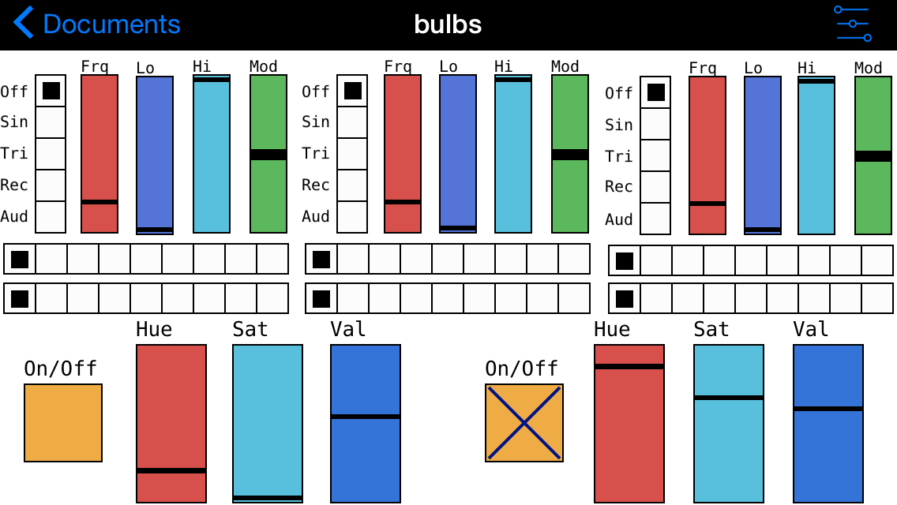

# Modular MyStrom Bulb App 

Flexible App für den iPod Touch zwecks Steuerung von 
[myStrom WiFi Bulbs](https://mystrom.ch/de/support/wifi-bulb/) mit dem offenen 
[REST_API_WRB.txt](https://mystrom.ch/wp-content/uploads/REST_API_WRB.txt) von einer in 
[PdParty](http://danomatika.com/code/pdparty) laufenden 
[Pure Data](http://puredata.info/) App aus über einen Service auf einem 
[Raspberry Pi](https://www.raspberrypi.org/learning/hardware-guide/components/raspberry-pi/).

* [Anleitung](doc/userdoc.md)
* [Netzwerk-Topologie](doc/network.md)
* [Architektur bulbs.pdz](doc/architecture.md)

