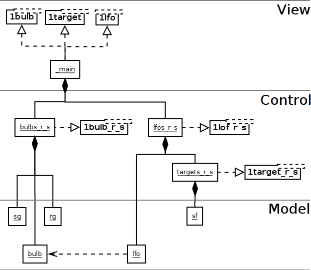
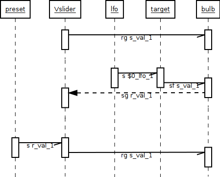
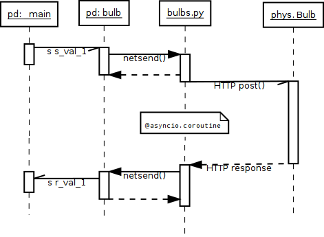

# Schichten-Architektur

Die View-Schicht ist ausschliesslich für das GUI verantwortlich. Die einzelnen, auf den Wertebereich 0..1 standardisierten Elemente kommunizieren über send/receive-Paare mit der Control-Schicht. Diese verbindet jedes einzelne dieser Paare über den mit DNS-Namen und Port konfigurierten `bulbs.py`-Server mit den einzelnen myStrom Bulbs.

## View: Editieren des Designs

Der Patch `_main.pd` enthält das gesamte GUI, das beliebig umgeordnet oder durch Löschen reduziert werden kann. Zum hinzufügen von weiteren Elementen können die Templates `1bulb.pd`, `1lfo.pd` und `1target.pd` zum copy-pasten verwendet werden. Das `renum.py`-Skript setzt die Nummern-Suffixe der verwendeten send/receive-Paare auf die beim Aufruf angegebene Zahl, damit diese nicht für jedes neue Element einzeln geändert werden müssen.

## Control: Verkabeln neuer Elemente

Die Patches `bulbs_r_s.pd`, `lfos_r_s.pd` und `targets_r_s.pd` verbinden die jeweiligen Bulbs und LFOs mit den entsprechenden GUI-Elementen. Für jedes zusätzliche Element können wie beim GUI die Templates `1bulb_r_s.pd` und `1lfo_r_s.pd` mit `renum.py` auf das GUI abgestimmt und zum copy-pasten in den jeweiligen Haupt-Patch verwendet werden.

Die LFOs senden ihre Parameter via `targets_r_s.pd` direkt an die Bulb, analog zu den GUI-Reglern via `bulbs_r_s.pd`. Die sichtbare rhythmische Bewegung der Regler ist daher ein indirekter Effekt, denn zurückgeleitet wird die REST-Response der Bulb. Daher widerspiegeln die Regler-Stände den tatsächlichen Ist-Zustand, nicht den von den LFOs angesteuerten Soll-Zustand der Bulb. 

## Model: Alles schon da

Keine der restlichen Patches, die konzeptuell zur Model-Schicht gehören, müssen für Erweiterungen angepasst werden. Globale Konfigurationsparameter wie das speedlim (Abtastfrequenz von Reglern und LFOs) sind in `bulbs_r_s.pd` zentralisiert. Als Ganzes kommuniziert die Model-Schicht via Pure Datas FUDI-Protokoll mit dem `bulbs.py`-Service als Vermittler zu den myStrom-Bulbs mit deren REST-API. Einzig die DNS-Namen der einzelnen Bulbs müssen dort auf `bulbs_r_s.pd` abgestimmt werden.

### Asynchrone Kommunikation

Weil die Bulbs zwar durchscnittlich ganz kurze Antwortzeiten haben (ca. 25ms), aber immer wieder um eine Grössenordnung längere Pausen einlegen, muss die Kommunikation asynchron laufen, denn in Pure Data existiert kein simpler Weg, zu schnell eintreffende Requests zu buffern. Und das `speedlim` soweit zu erhöhen, dass nur selten Messages übergangen werden, führt zu störendem Flackern bei Verwendung der LFOs.

Daher ist obiges Send-Receive-Sequenzdiagramm eine Vereinfachung. Der `bulbs.py`-Server wartet nämlich die Response der physischen Bulb auf den Request nicht ab, um direkt eine Antwort auf das ursprüngliche `netsend` aus Pure Data zu senden, sondern sendet erst nach Rückkehr im Schwanz der Koroutine, also *nach* `yield from writer.drain()`, einen REST-Request an die Bulb ab. Erst nach Eintreffen der JSON-Response öffnet er einen zweiten Socket zur Initiierung einer umgekehrten `netsend`-Antwort an Pure Data. Zu schnelle Requests stabeln sich dabei innerhalb des Koroutinen-Stacks und werden nicht einfach unterschlagen.

### Regler-Messages, Bang und Feedback-Messages

Wird ein Regler im GUI verändert, erfolgt eine Message an die Bulb. Diese antwortet per myStrom-REST-Protokoll mit allen Parameter-Werten, hier ein Beispiel:

    >Bulb: {'action': 'on'}
    <Bulb: {'ramp': 100, 'on': True, 'color': '344;0;0', 'notifyurl': '', 'mode': 'hsv'}

Soweit, so simpel, dafür wäre kein Werte-Feedback nötig. Doch beim Startup erfolgt ein leerer Loadbang-GET-Request an jede Bulb, welche die gegenwärtigen Parameter-Werte ausliest und ans GUI zurückmeldet, so dass dieses synchronisiert wird. Diese Message ist ausführlicher (enthält z.B. den Stromverbrauch), es werden aber fürs GUI dieselben Parameter rausgefiltert:

    >Bulb: None
    <Bulb: {'ramp': 100, 'meshroot': False, 'type': 'rgblamp', 'on': True, 'reachable': True, 'power': 5.1, 'color': '43;0;100', 'fw_version': '2.25', 'mode': 'hsv', 'battery': False}

Das Feedback erfolgt generalisiert immer. Daher müssen Feedback-Loops unterbunden werden, und zwar in zwei Fällen: Derjenige Regler, welcher gerade kontinuierlich bewegt wird, darf nicht auch noch ein zeitverzögertes Feedback mit vorhergehenden Werten erhalten, denn das führt zu einem Brems-Effekt. Zweitens darf eine Feedback-Message an einen Regler nicht nochmal eine identische Message an die Bulb senden, welche wiederum Feedback auslösen würde. Daher werden nicht direkt die send/receive-Objekte von Pure Data verwendet, sondern folgende Objekte:

* `sg` Send mit zusätzlichem Gate-Eingang zur Verhinderung des Brems-Effekts
* `rg` Receive-Gate-Timer, welcher nach Erhalt einer Message das `sg`-Gate für 300ms schliesst
* `sf` Send mit feedback-Präfix, verwendet von den LFOs, unterdrückt das Schliessen des Gate. 

### Presets

Die Presets verwenden ein `qlist`-Objekt, um sämtliche GUI-Parameter-Werte zu speichern. Dazu wird an alle GUI-Objekte ein Bang gesendet, damit dieses den aktuellen Wert an das `value`-Receive-Objekt sendet, wo es in ein `textfile` gespeichert wird. Umgekehrt sendet die `qlist` beim Laden den Wert an die jeweiligen Receives der GUI-Objekte (nicht direkt an die Bulb wie bei den LFOs), was dann die entsprechenden Messages an die Bulb auslöst, inklusive Receive-Gate-Timer, genau wie wenn die Regler von Hand bewegt worden wären.
