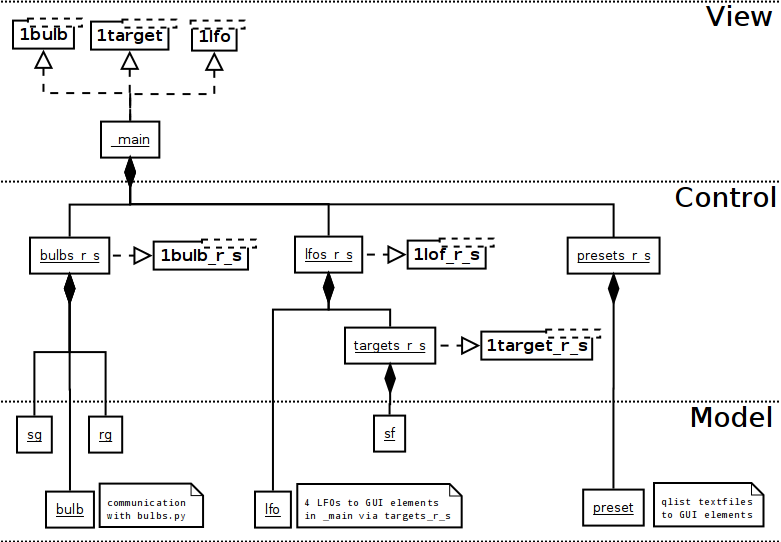

# Schichten-Architektur

Die View-Schicht ist ausschliesslich für das GUI verantwortlich. Die einzelnen, auf den Wertebereich 0..1 standardisierten Elemente kommunizieren über send/receive-Paare mit der Control-Schicht. Diese verbindet jedes einzelne dieser Paare über den mit DNS-Namen und Port konfigurierten `bulbs.py`-Server mit den einzelnen myStrom Bulbs.

## View: Editieren des Designs

Der Patch `_main.pd` enthält das gesamte GUI, das beliebig umgeordnet oder durch Löschen reduziert werden kann. Zum hinzufügen von weiteren Elementen können die Templates `1bulb.pd`, `1lfo.pd` und `1target.pd` zum copy-pasten verwendet werden. Das `renum.py`-Skript setzt die Nummern-Suffixe der verwendeten send/receive-Paare auf die beim Aufruf angegebene Zahl, damit diese nicht für jedes neue Element einzeln geändert werden müssen.

## Control: Verkabeln neuer Elemente

Die Patches `bulbs_r_s.pd`, `lfos_r_s.pd` und `targets_r_s.pd` verbinden die jeweiligen Bulbs und LFOs mit den entsprechenden GUI-Elementen. Für jedes zusätzliche Element können wie beim GUI die Templates `1bulb_r_s.pd` und `1lfo_r_s.pd` mit `renum.py` auf das GUI abgestimmt und zum copy-pasten in den jeweiligen Haupt-Patch verwendet werden.

## Model: Alles schon da

Keine der restlichen Patches, die konzeptuell zur Model-Schicht gehören, müssen für Erweiterungen angepasst werden. Globale Konfigurationsparameter wie das speedlim (Abtastfrequenz von Reglern und LFOs) sind in `bulbs_r_s.pd` zentralisiert. Als Ganzes kommuniziert die Model-Schicht via Pure Datas FUDI-Protokoll mit dem `bulbs.py`-Service als Vermittler zu den myStrom-Bulbs mit deren REST-API. Einzig die DNS-Namen der einzelnen Bulbs müssen dort auf `bulbs_r_s.pd` abgestimmt werden.
