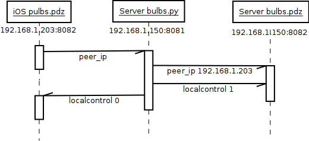
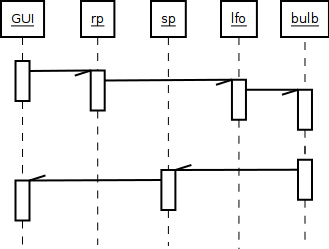
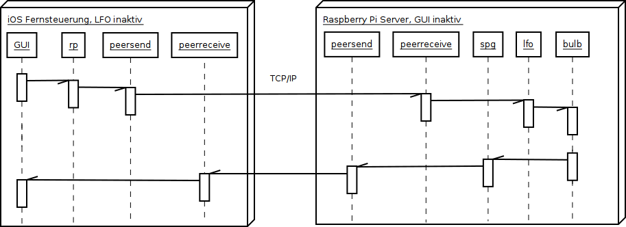

# PureData GUI und LFO-Engine auf Client/Server

Schon PdParty selbst trennt das GUI von der (LFO-)Engine (siehe [Architektur bulbs.pdz](architecture.md)) - die Kommunikation mit den GUI-Elementen erfolgt zwingend mit Messages durch send/receive-Paare. So kann die ganze `bulbs.pdz`-Applikation aufgeteilt werden in einen Client auf dem iOS-Gerät und einen Server auf dem Raspberry Pi. Die GUI-Messages werden anstatt direkt über send/receive via TCP/IP über netsend/netreceive geroutet. Wird PdParty geschlossen, laufen die LFOs auf dem Server weiter und machen die animierte Licht-Szene beim Einschalten der Bulbs unabhängig vom iOS-Gerät. Trotzdem kann die Server-Applikation transparent via PdParty gesteuert werden, ganz so, als laufe alles nur lokal.

## Anmelde-Sequenz
Um für die bidirektionale Kommunikation keine fixe IP für das iOS-Gerät nötig zu machen, ist mit `bulbs.py` eine Anmeldesequenz implementiert, welche bei laufendem `bulbs.pdz`-Server die Client-IP des sich anmeldenden iOS-Geräts ermittelt und `localcontrol` entsprechend verteilt, damit nicht Client und Server gleichzeitig Messages an die Bulb senden.

## Modus lokale Kontrolle

Erhält eine `bulbs.pdz`-Instanz die Message `localcontrol 1` bzw. `localgui 1`, bleibt es beim Default-Modus: Die `localcontrol.pd`- bzw. `localgui.pd`-Weichen in den Objekten `sp.pd` (send to peer) `spg.pd` (send to peer gui) und `rp.pd` (receive for peer) leiten alle Messages direkt durch das interne Messaging-System innerhalb der Applikation weiter.

## Modus entfernte Kontrolle

Die Message `localcontrol 0` schaltet die `localcontrol.pd`-Weichen um auf entfernte Kontrolle: Das Objekt `spg.pd` (send to peer gui) routet die Message indirekt via `peersend.pd` an die jeweilige andere Instanz, wo sie von `peerreceive.pd` empfangen wird und in das interne Messaging-System eingespeist wird. 

Dabei bekommt der `bulbs.pdz`-Server `localcontrol 1` und `localgui 0`, der `bulbs.pdz`-iOS-Client bekommt `localcontrol 0` und `localgui 1`. Diese Trennung wurde nötig, weil der Server zwar local control hat (wie ein Standalone-Client), aber kein GUI. Control Messages gehen also via `bulbs.py` an die Bulb selbst, GUI Messages aber an den Client.

Das ähnliche Objekt `rp.pd` (receive for peer) dient zur Anbindung von GUI-Elementen, die nur über ein "nacktes" send/receive-Paar verfügen: Ein direktes send an das GUI-receive ginge verloren. Statt dessen leitet `rp.pd` die Message ebenfalls über `peersend.pd`an die jeweilige andere Instanz.

