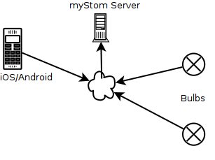
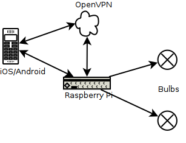
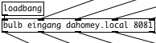
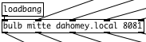

# Netzwerk-Topologie

Die mmba bulbs App kommuniziert über das 
[REST_API_WRB.txt](https://mystrom.ch/wp-content/uploads/REST_API_WRB.txt) mit den Bulbs. Anders als mit der nativen myStrom App fragt nicht die Bulb ihren Soll-Zustand vom Server ab, der mit der App dort gewetzt wurde:

sondern die App initiiert die Kommunikation, fragt beim Start den Zustand der konfigurierten Bulbs ab und modifiziert diesen mit einzelnen HTTP-Requests:

## Konfiguration `bulbs.pdz`

Der DNS-Name des RPI-Servers mit dem `bulbs.py`-Service muss dem IOS/Android im lokalen Netzwerk bekannt sein und in die beiden bulb.pd-Instanzen in `bulbs_r_s.pd` eingetragen werden (`dahomey.local` im Beispiel). Die DNS-Namen der einzelnen Bulbs (`eingang` und `mitte` im Beispiel) davor müssen nur dem RPi-Server selbst bekannt sein, es genügt also, sie dort ins /etc/hosts einzutragen.

## Konfiguration `bulbs.py`

Im `bulbs.py` Server-Skript müssen zusätzlich zu den DNS-Namen der einzelnen Bulbs noch deren individuelle MAC-Adressen konfiguriert werden, da das API diese als Teil der Request-URL verlangt. Bei Bedarf kann auch der TCP-Port, auf den der Dienst hört, geändert werden:

    PORT = 8081
    BULBS = {
        "eingang" : "5CCF7FA0C8B4",
        "mitte" : "5CCF7FA0CA06",
    }
