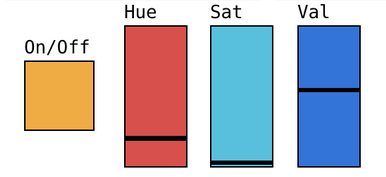
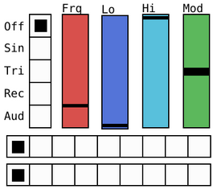

# Anleitung

## Inbetriebnahme

Das Skript `bulbs.py` wird mit

    sudo make install

auf einem Linux Server mit systemd, z.B. einem Raspberry Pi, installiert und als Dienst gestartet. Die Datei bulbs.pdz wird auf einem iOS-Gerät in PdParty importiert und gestartet. Ist das [Netzwerk](doc/network.md) mit den DNS-Namen von Bulbs und Server passend konfiguriert, fragt die App den aktuellen Zustand der Bulbs ab und stellt die Regler in der unteren Hälfte auf die ausgelesenen Werte ein.

## Manuelles Regeln

Die breiten Regler in der unteren Hälfte entsprechen dem Farbrad und dem Helligkeitsregler in der nativen myStrom App: Hue regelt den Farbton, Sat die Farbsättigung (Weissanteil) und Val den Helligkeitswert.

## Automatische Steuerung

Die LFOs (Low Frequency Oscillators) in der oberen Hälfte erlauben eine automatische Orchestrierung der Beleuchtung wie mit einer 80er-Jahre Lichtorgel. Mit den senkrechten Schaltknöpfen links wird die Wellenform gewählt, mit den Schaltknöpfen unten das Ziel der Modulation, genau wie bei einem Analog-Synthesizer.

### Modulares Routing

Die waagrechten Schaltknöpfe unterhalb leiten die Modulationswelle an das gewählte Ziel. Ganz links ist aus, die nächsten 4 Knöpfe zielen auf die Regler On/Off, Hue, Sat und Val der linken Bulb, die letzten vier Knöpfe auf dieselben Regler der rechten Bulb. Die zweite Schaltfläche darunter hat dieselben Ziele.

### Wellenformen

Die Regler Lo und Hi begrenzen bei allen Wellenformen den Wertebereich. Ist Lo höher als Hi, kehrt das die Welle um. Die andern Regler Freq und Mod unterscheiden sich je nach Wellenform:

* Sin (Sinus): Freq = Schwingfrequenz, Mod ist wirkungslos
* Tri (Dreieck): Freq = Schwingfrequenz, Mod = Schiefe, am oberen bzw. unteren Ende wird das Dreieck zum Sägezahn.
* Rec (Rechteck): Freq = Schwingfrequenz Mod = Pulsbreite, an den Extremen wird die Wellennadel zu kurz, um wirksam zu sein.
* Aud (Audio): Freq = Zentrum des Bandpassfilters, Mod = Empfindlichkeit auf Transienten als Abweichung von der Durchschnittslautstärke über ca. 2 Sekunden.
